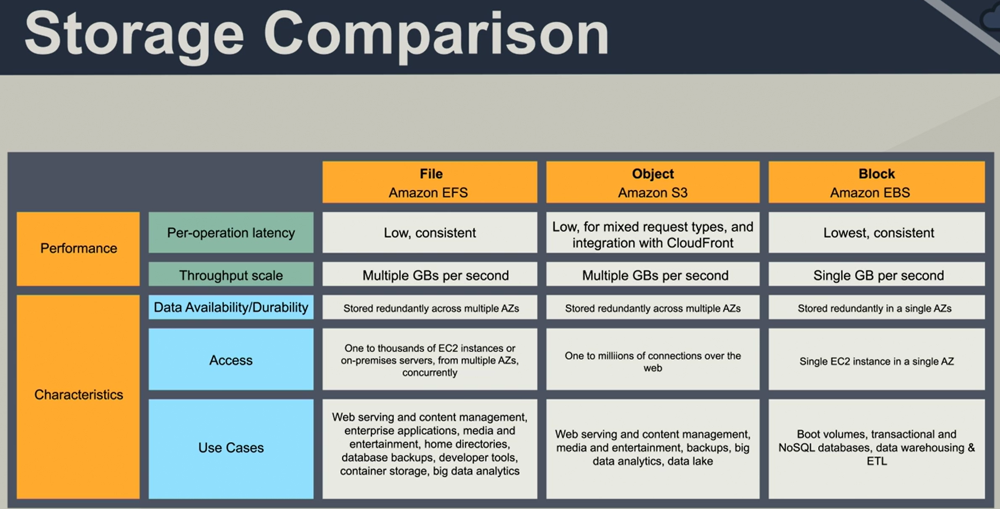
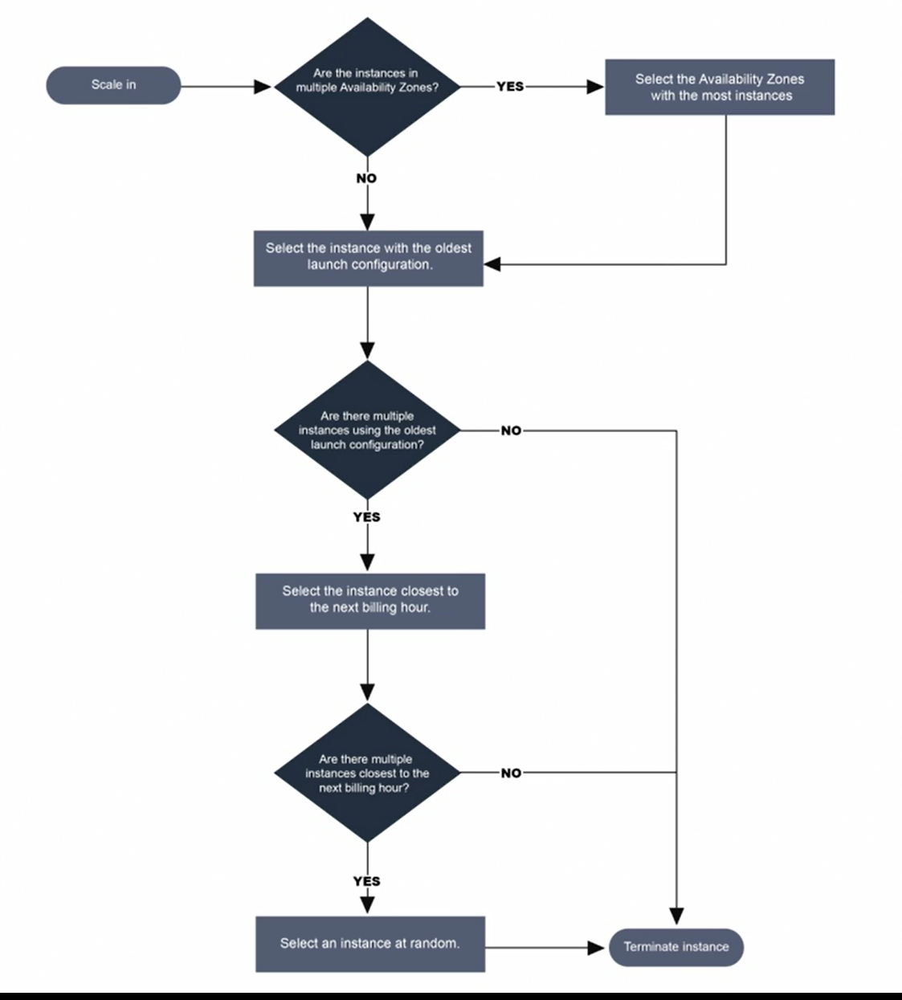
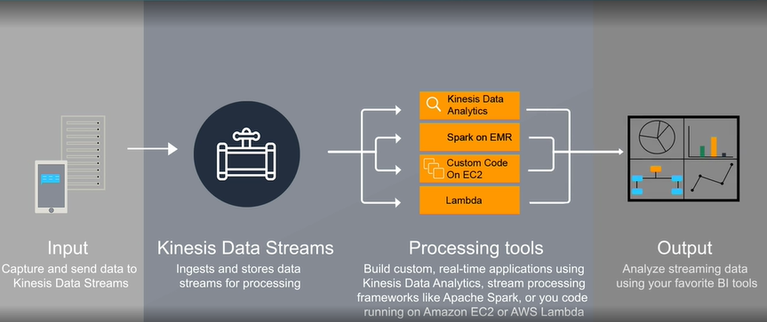
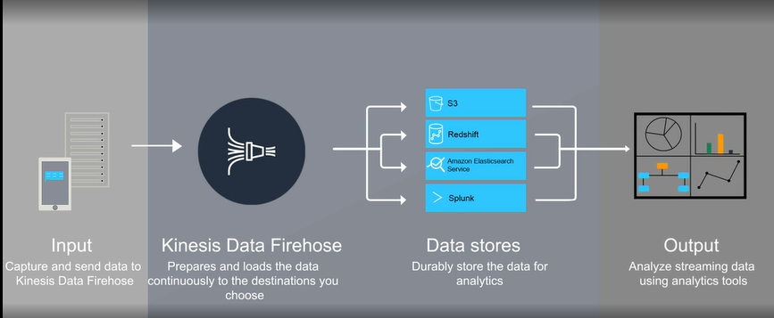
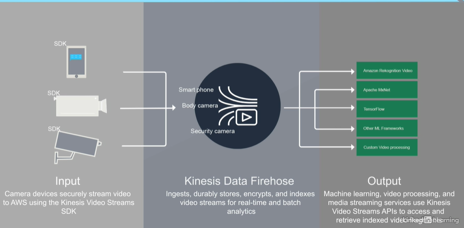
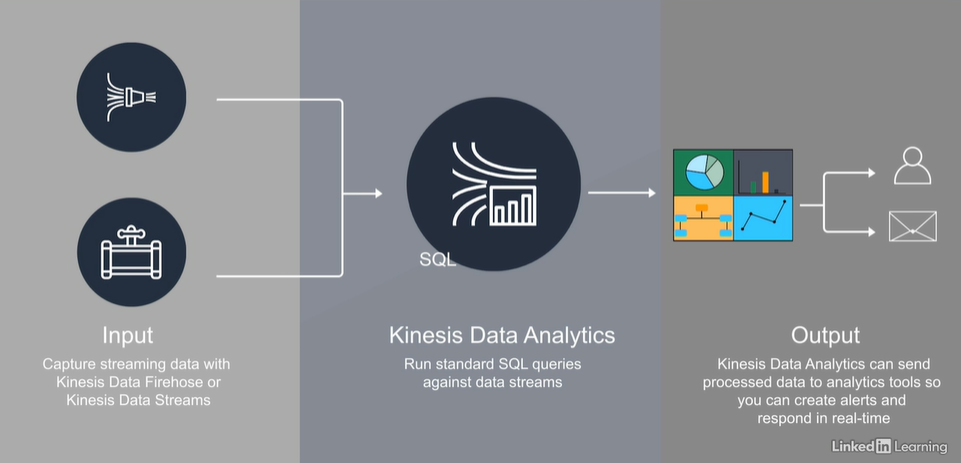

## storage type:
1. S3 (object)
2. Glacier
3. EBS (block)
4. Storage Gateway
5. Snow family
6. Databases

selecting storage factor:
1. capacity(size)
2. performance
3. cost

### S3:
S3 storage is distributed across 3 AZs, except 1A, which uses one zone and is less expensive.
S3 allows for automatic data classification
files stored in s3 can be encrypted
object in S3 buckets have eventual consistency
object in Elastic Block Stores are consistent
very good use of S3 buckets is static websites
1. object storage
- 
2. getting data into s3
- API
- Amazon direct connect
- Storage gateway
- Kinesis Firehose
- Transfer Acceleration
3. Snow Family
- Snowball (Petabyte-scale)
- Snowball Edge (100 TB local storage)
- Snowmobile (Exabyte-scale)
### S3 operations:
1. creating and deleting buckets
2. writing objects
3. reading objects
4. deleting objects
5. managing objects properties
6. listing keys in buckets

### Terms
1. Buckets:
2. Regions:
3. Objects:
4. Keys:
5. Object Urls:
6. Eventual Consistency

### S3 Features
1. Prefixed and delimiters
2. Storage Classes
3. Object lifecycle management
4. Encryption
   - not transit security, but store security(because it decrypts before transits)
5. Versioning
6. MFA Authentication delete
7. Multipart upload
8. Range Gets
9. Cross-Region replication
10. logging
11. Event Notification

### Storage Class
1. Amazon S3 standard $$$$$
2. Amazon S3 Infrequent Access Storage(IA) $$$$
3. Amazon S3 Reduced Redundancy Storage(RRS) $$
4. Glacier $

### Glacier
1. used for archival data storage
2. Vault(glacier) = bucket(s3),  archive(glacier) = object(s3)
3. Expedited access: 3-5 min
4. Standard access: 3-5 hours
5. Bulk access: 5-12 hours
6. an AWS account create up to 1000 vaults per region
7. support multipart uploads of archives.

### Storage gateway
1. file gateway
2. volume gateway
3. tape gateway
4. Virtual Tape Library: library of backup "tapes" that are actually just objects stored in an S3 bucket

### S3 enhance feature
1. life cycle rule
2. WORM (write one and read many times)
3. Batch processing for S3 bucket
   - manifest: collection fo all the objects, listing of them

### EBS (Elastic block store)
1. durable storage in EC2 instances
2. block level
3. type
    - Magnetic
      - Cold HDD: Large but low speed
      - Throughput HDD: potentially large and fast
      - Standard HDD: middle of road (free tier)
    - SSD
      - general purpose (not guarantee IOPS)
      - provisioned IOPS (PIOPS)
        - PIOPS (provisioned input/output operations per second)
      - EBS-optimized instance should be used
        - if don't, you will be paying for the ssd but not getting the ssd performance.
4. Snapshot
5. Volume recovery
6. Encrypt volume
7, can be attached to any EC2 instance in the same Availability Zone

### EFS (Elastic File System)
1. shareable among instance
2. hierarchical (real folder)
3. can be accessed through NFSc4
4. not supported on Windows instances
5. storage compare 

### private endpoint
1. allows for secure connection between VPCs, services, and applications in AWS
2. each endpoint need a fix ip address that means it will cost you monthly.

### Amazon FSx
1. four type file systems: Windows File Server，Lustre (high-performance file system)。NetApp ONTAP。OpenZFS

## Compute Services

1. Type
   - General Purpose: T2,M5,M4,M3
     - T2 -- burst performance
     - others no burst option
   - Compute Optimized: C5,C4,C3
     - useful for cpu intensive applications
   - Memory Optimized:
     - X1e,X1,R4,R3
   - Storage Optimized
     - H1,I3,D2
   - Advance Computing
     - P3,P2,G3,F1
   - I3en
     - a
   - C5n
     - b
     
2. pricing
   - on demand
     - pricing incurs charge base on usage and is billed in 60 second increments
       - the instance running
       - the appropriate storage
       - the appropriate network throughput
       - minutes charge
   - reserved
     - pricing is based on at least 1 year reservation
       - Hours
       - reserve usage minimum 1 year
       - less expensive than on-demand
   - spot 
     - pricing is the least expensive because you are using unused compute time.
       - bid on unused compute time
       - up to 90% discount over on-demand

3. EBS(persistent block storage)
   - to use EBS, EBS optimized instance should be deployed
   - Magnetic or SSD

4. Models:
   - Share Tenancy (default tenancy)
     - Multiple users share the time and space on the physical machine.
       - Pros
         - Reduced costs
         - Simpler deployment
       - Cons
         - Lower performance
         - Less control
   - Dedicated host (BYOL:bring your own license)
     - dedicate physical machine to you
       - Pros
         - more accurate licensing management
       - Cons
         - cost more
   - Dedicated instance
     - runs on a physical machine 
       - Pros
         - runs on hardware dedicated to the customer
         - provides performance advantage of a dedicated host
       - Cons
         - less accurate licensing management
5. AMI
   - PV
   - HVM
   - Instance Root Volume
   <table>
       <tr>
          <td></td>
          <td>store-backed AMI</td>
          <td>EBS-backed AMI </td>
       </tr>
       <tr>
          <td>Stored</td>
          <td> S3 </td>
          <td> EBS </td>
       </tr>
       <tr>
          <td>Stop Action</td>
          <td> No support </td>
          <td> Support </td>
       </tr>
       <tr>
          <td>On failure, data lost</td>
          <td> Yes </td>
          <td> No </td>
       </tr>
   </table>

6. Bootstrapping allows you to launch a instance and have a configuration script run on first launch
7. .
8. AWS Batch
    - job -> script
      - is a unit of work
9. ECS (Elastic Container Service)
   - No virtual machine builds required
   - Uses Amazon Fargate to automatically build environments
   - can use EC2 to obtain more control

10. Elastic Beanstalk

## IAM
User,group and roles are principles
1. Root User
   - Creating a CloudFront key pair
   - Enabling Multi-Factor Authentication(MFA) on an S3 bucket
   - Restore permission for other IAM users
2. Authentication
   - validation for credentials
   - credentials provide identity
   - single-factor
   - multi-factor
   - authentication of people with user accounts
   - authentication of processes with roles
   - username and password to get into the console
   - access key and secret key in order to communicate through the APIs or the CLI
3. Authorization
   - Policies
     - rules that determine allowed actions or access
     - used throughout AWS
     - uses json
       - created by GUI
       - coded directly
     - Vary by object
     - validation of actions
     - provided by AWS policies
     - Identity-based policies
       - used with users, groups, or roles
     - Resource-based policies
       - used for cross-account access(accounts from different AWS subscriptions)
4. MFA
   - Virtual MFA Device(Free)
5. Multiple Permission
   - All allows are cumulative
   - Deny is override
   - Boundaries
     - User's permission is policy and boundary interaction
6. default password policy
   - Min 8 characters
   - Max 128 characters
   - At least 3 of these 4 characters types:
     - uppercase
     - lowercase
     - numbers
     - special characters
     - can't be the same as the account name or email
7. Least Privilege
   - grant only the access needed
8. Roles
   - Roles are used by the CLI and programs 
9. CloudTrail
   - logging services
     - governance
     - compliance
     - auditing
     - event histories
     - Cloud watch can alert
     - for 90 days

## Auto scaling
1. Overview
   - scalable aws resource
     - EC2 Auto scaling groups
     - Aurora DB clusters
     - DynamoDB global secondary indexes
     - Elastic Container Service(ECS) services
     - Spot Flee requests
     
2. Termination policy
   - 
   - oldest configuration then nearest cost hour
   - Custom termination policy
     - Oldest instance
     - Newest instance
     - OldestLaunchConfiguration
     - ClosestToNextInstanceHour
     - Default
3. auto scaling
4. load balance
   - Sender initiated
     - the sender choose best node 
   - Receiver initiated
     - the receiver choose best node
   - Algorithm
     - Round Robin
     - Randomized
     - Centrally Managed
     - Threshold-Based
5. Elastic Load Balancing (ELB)
   - Highly Available
   - Secure
   - Flexible
   - Monitoring and auditing included
   - Elastic
   - Hybrid
   - Type
     - Application Load Balancer
     - Network Load Balancer
     - Classic Load Balancer - for older environment (earlier than 2018)
   - support services
     - EC2
     - ECS
     - Auto Scaling
     - CloudWatch
     - Route 53
6. DNS
   - RFCs 1034 (architecture) and 1035 (protocols)
   - DNS database is called Zone
     - it can be transferred to other DNS server
   - Ip address -> host (Reverser lookup)
   - Host -> ip address (Forward lookup)
   - A and AAAA
     - Hostname > IPv4 or IPv6
   - NS
     - Domain -> hostname
   - MX
     - Mail exchange record
   - CNAME
     - Alias for the real name (canonical): like short url
7. Route 53
8. ACLs and NACLs
9. Flow logs
   - log traffic passing through your AWS network
   - Flow logs store the logs in the CloudWatch service

## Databases
1. EC2-base instance (instance based)
   - install by yourself
2. Host-base instance (service based)
   - AWS help you to launch databases
3. Scalability
   - User Script to scale out
   - Read Replica
     - only-read database: avoid to affect the writing performance.
4. Security
   - RDS databases support "at rest" encryption
     - must be enabled at creation time
     - can be enabled on recovery(manually)
   - Data access based on database capabilities (based on IAM):
     - CRUD (inside the database)
     - DB admin (manage the RDS)
5. Aurora:
     - Optimized for Online Transaction Processing - very fact writes
     - MySQL compatible
6. Redshift
   - kind of OLAP(online analytical processing) database
   - data warehouse database
   - Single node
     - 160 GB
   - Multi node
     - Price
       - $0.25 per hour or $1k per TB per year
     - Leader node
       - connection and queries
     - Compute node
       - store data and execute the queries
     - Columnar data stores
       - like excel express sheet
     - Data compression 
     - Massively Parallel Processing (MPP)
     - Security
       - SSL
       - AES 256 encryption at rest data
       - keys managed by AWS Key Management
     - Availability
       - Operation in one AZ
       - Snapshots can be restored to new AZs
7. DynamoDB
   - noSQL database
   - millisecond latency at any scale
   - Read consistency types
     - Eventual consistent reads
       - delays by few seconds
     - Strongly consistent reads
       - within milliseconds
     -  Price
       - Storage
         - $0.25/GB per month
       - Throughput
         - Write
           - billed per hour for every 10 units
         - Read
           - billed per hour for every 50 units
         - 1 unit equals 1 write per second 
## Application
1. lambda
   - compute service - runs code without servers
   - only run when needed
   - scale automatically
     - up to thousands of requests per second
   - billed by compute time
   
2. Api Gateway (Serverless architecture: lambda + API Gateway)
   - API management in the cloud
   - interact with AWS services, external web services, and data stored in AWS
     - create
     - publish
     - maintain
     - monitor
     - secure
3. Kinesis
   - Processes streaming data
   - Real-time analytics
   - kinesis Data Streams
     - 
   - kinesis Data Firehose
     - 
   - kinesis Video Streams
     - Media Services
     - 
   - kinesis Data Analytics 
     - based on standard sql queries
     - support concurrent consumers
       - Redshift
       - S3
       - Elasticsearch
       - Lambda
       - Kinesis Data Streams
     - 

4. CloudFront
   - it's CDN
   - regional edge caches -> regional edge locations

5. WAF
   - Allow/block
   - monitor
   - error handling
   - configurable default behavior
   - suit for public access in internet
   
6. SQS (Simple Queue Services)
   - message producers
   - message consumers
   - maximum 256 KB of data
   - messaging service <- SQS
     - redundant across multiple AZs
     - Queued until processed
     - retention up to 14 days
     - automatically scales
     - Types:
       - Standards (non-sequential,higher performance)
       - First-In-First-Out (sequential, lower performance)
       
7. SNS (notification)
   - pub-sub mechanism
   - delivery options
     - HTTP/HTTPS
     - E-Mail
     - SMS
     - Lambda
     - SQS
   - limits
     - up to 256 KB of data
     - SMS constrains:
       - up to 140 bytes
     - Aggregate SMS: 1600 bytes

8. SWF (Simple WorkFlow)
   - Defines the sequence of events required to achieve a workflow
   - used in decoupled application

9. Step function
   - eventually replacing SWF
   - State machine
     - decider
     - activity task
     - work task

10. OpsWorks 
    - Configuration management service
    - Automated deployment
    - OpsWorks Stacks include layers of services and runtime environments
    - Chef Automate uses cookbooks of recipes to launch solutions
    - Puppet uses master servers wih pre-configured modules

11. Cognito
    - support user identity and data synchronization service - SSO
    - Public identity providers - Google,Facebook,Amazon
    - Private identity providers - Active Directory with SAM
    - Based on open standards - OAuth 2.0,SAML 2.0, OpenID connect
    - Profile Management
    - AWS Integration
      - Cognito controls access
      - Define roles
      - Map users to roles

12. Elastic MapReduce(EMR)
    - Distributes processing across clusters
      - Implements a managed Hadoop framework
      - Pulls data from S3
      - Uses EC2 instances
      - User defines the number of needed clusters 
      - Master node
        - coordinates job distribution across core and task nodes
      - Core node
        - Runs tasks assigned by the master node.
        - Stores data in the cluster
      - Task node
        - Runs only tasks that do not store data

13. CloudFormation
    - deploy a collection of multiple instances to form a complete solution
    - Templates -> stacks -> change set 
    - Rapid deployment
    - Mirror existing internal architectures
    - Take advantage of templates created by others
    - CloudFormation Properties
      - there is a documents can review

14. Cloud watch
    - monitors the cloud and on-premises systems
    - Dashboards
    - Logs
    - Events
    - Alarms
    - Push on-premises logs into the cloud
    - Cross log group querying

15. Trusted Advisor
    - check it supported before the exam
    
16. Organizations
    - collection of AWS accounts
    - one management interface 
    - billing
    - account management
    - Organizational units (OUs)
      - hierarchical account management
      - nest OUs up to five levels deep
      - policies attached for permissions
      
## Four aspects:
1. Resilient
2. Performant
3. Secure
4. Cost